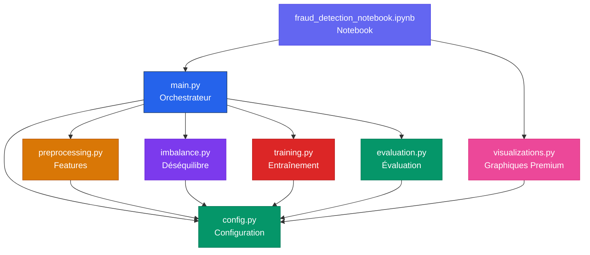
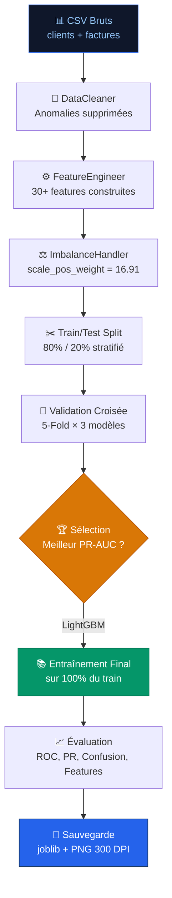

# 📋 RAPPORT TECHNIQUE COMPLET — Détection de Fraude Énergétique STEG Tunisie

**Projet Académique de Fin d'Études**  
**Date** : Juin 2026  
**Environnement** : Python 3.13, Windows 11

---

## Table des Matières

1. [Introduction & Contexte](#1-introduction--contexte)
2. [Architecture du Projet](#2-architecture-du-projet)
3. [Inventaire Complet des Fichiers](#3-inventaire-complet-des-fichiers)
4. [Analyse Détaillée de Chaque Module](#4-analyse-détaillée-de-chaque-module)
   - 4.1 [config.py — Configuration Centrale](#41-configpy--configuration-centrale)
   - 4.2 [preprocessing.py — Prétraitement & Feature Engineering](#42-preprocessingpy--prétraitement--feature-engineering)
   - 4.3 [imbalance.py — Gestion du Déséquilibre](#43-imbalancepy--gestion-du-déséquilibre)
   - 4.4 [training.py — Entraînement Multi-Modèles](#44-trainingpy--entraînement-multi-modèles)
   - 4.5 [evaluation.py — Évaluation & Explicabilité](#45-evaluationpy--évaluation--explicabilité)
   - 4.6 [visualizations.py — Visualisations Premium](#46-visualizationspy--visualisations-premium)
   - 4.7 [main.py — Orchestrateur Principal](#47-mainpy--orchestrateur-principal)
   - 4.8 [fraud_detection_notebook.ipynb — Notebook Jupyter](#48-fraud_detection_notebookipynb--notebook-jupyter)
   - 4.9 [requirements.txt — Dépendances](#49-requirementstxt--dépendances)
5. [Flux du Pipeline ML](#5-flux-du-pipeline-ml)
6. [Feature Engineering — Détail des 30+ Variables](#6-feature-engineering--détail-des-30-variables)
7. [Modèles Utilisés & Hyperparamètres](#7-modèles-utilisés--hyperparamètres)
8. [Résultats & Performances](#8-résultats--performances)
9. [Fichiers de Sortie Générés](#9-fichiers-de-sortie-générés)
10. [Transposabilité & Perspectives](#10-transposabilité--perspectives)

---

## 1. Introduction & Contexte

### 1.1 Problématique

La **STEG** (Société Tunisienne de l'Électricité et du Gaz) est confrontée à des pertes non-techniques significatives causées par la fraude énergétique : manipulation de compteurs, déclarations sous-estimées, raccordements illicites. Ces fraudes représentent un manque à gagner considérable pour le réseau.

### 1.2 Objectif

Concevoir un **système de détection de fraude automatisé** basé sur le Machine Learning, capable de :

- **Détecter** les comportements frauduleux à partir de l'historique de facturation
- **Scorer** chaque client avec une probabilité de fraude
- **Expliquer** les facteurs discriminants aux opérateurs terrain
- **Servir de PoC** (Proof of Concept) transposable aux réseaux d'Afrique de l'Ouest

### 1.3 Dataset

Le dataset STEG est composé de **4 fichiers CSV** :

| Fichier | Description | Contenu |
|---------|-------------|---------|
| `client_train.csv` | Clients d'entraînement | ~135 000 clients avec la colonne `target` (0 = légitime, 1 = fraude) |
| `client_test.csv` | Clients de test | Clients sans la colonne target |
| `invoice_train.csv` | Factures d'entraînement | ~1 800 000 factures avec consommation, index, dates |
| `invoice_test.csv` | Factures de test | Factures correspondant aux clients test |

> [!IMPORTANT]
> Le dataset est **fortement déséquilibré** : seulement ~5.58% des clients sont des fraudeurs (classe 1). C'est un défi majeur que le pipeline adresse explicitement.

### 1.4 Colonnes du Dataset

**Table Clients :**
| Colonne | Type | Description |
|---------|------|-------------|
| `client_id` | string | Identifiant unique du client |
| `disrict` | int | Code district géographique |
| `client_catg` | int | Catégorie client (résidentiel, commercial, etc.) |
| `region` | int | Région géographique |
| `creation_date` | date | Date de création du compte (format DD/MM/YYYY) |
| `target` | int | **Variable cible** : 0 = légitime, 1 = fraude |

**Table Factures :**
| Colonne | Type | Description |
|---------|------|-------------|
| `client_id` | string | Lien vers la table clients |
| `invoice_date` | date | Date de la facture (format YYYY-MM-DD) |
| `tarif_type` | string | Type de tarif |
| `counter_number` | string | Numéro de compteur |
| `counter_statue` | int/string | Statut du compteur (0 = normal, >0 = anomalie) |
| `counter_code` | int/string | Code du compteur |
| `reading_remarque` | string | Remarque du releveur |
| `counter_coefficient` | float | Coefficient multiplicateur du compteur |
| `consommation_level_1` à `4` | float | Consommation par palier tarifaire |
| `old_index` | float | Index ancien du compteur |
| `new_index` | float | Index nouveau du compteur |
| `months_number` | int | Nombre de mois couverts par la facture |
| `counter_type` | string | Type de compteur (ELEC, GAZ) |

---

## 2. Architecture du Projet

### 2.1 Arborescence

```
detection_de_fraude/
├── 📄 config.py                    # Configuration centrale (144 lignes)
├── 📄 preprocessing.py             # Prétraitement & Features (647 lignes)
├── 📄 imbalance.py                 # Gestion déséquilibre (182 lignes)
├── 📄 training.py                  # Entraînement multi-modèles (295 lignes)
├── 📄 evaluation.py                # Évaluation & graphiques (490 lignes)
├── 📄 visualizations.py            # Visualisations premium (875 lignes)
├── 📄 main.py                      # Orchestrateur principal (195 lignes)
├── 📓 fraud_detection_notebook.ipynb  # Notebook Jupyter interactif
├── 📋 requirements.txt             # Dépendances Python (27 lignes)
├── 📊 client_train.csv             # Données clients (train)
├── 📊 client_test.csv              # Données clients (test)
├── 📊 invoice_train.csv            # Données factures (train)
├── 📊 invoice_test.csv             # Données factures (test)
└── 📂 outputs/
    ├── 📝 pipeline.log             # Journal d'exécution
    ├── 📂 models/
    │   └── best_model_lightgbm.joblib  # Modèle final sauvegardé
    └── 📂 plots/
        ├── confusion_matrix.png
        ├── roc_curve.png
        ├── precision_recall_curve.png
        ├── feature_importance.png
        ├── correlation_heatmap.png
        ├── dashboard_dataset.png
        ├── fraud_vs_legitimate.png
        ├── fraud_by_region.png
        ├── boxplots_comparison.png
        ├── model_comparison_bars.png
        ├── model_radar.png
        ├── threshold_analysis.png
        ├── performance_dashboard.png
        ├── probability_distribution.png
        └── output.png
```

### 2.2 Architecture Modulaire



### 2.3 Principes de Conception

| Principe | Description |
|----------|-------------|
| **Modularité** | Chaque fichier a une responsabilité unique et claire |
| **Reproductibilité** | Seed `RANDOM_SEED = 42` fixé globalement |
| **Configuration centralisée** | Tous les paramètres dans `config.py` |
| **Logging complet** | Double sortie : console + fichier `pipeline.log` |
| **Documentation** | Docstrings complètes (NumPy style) sur chaque classe/méthode |
| **Robustesse** | Gestion d'erreurs, conversions numériques sécurisées, valeurs par défaut |

---

## 3. Inventaire Complet des Fichiers

| Fichier | Lignes | Taille | Classes | Fonctions/Méthodes | Rôle |
|---------|--------|--------|---------|---------------------|------|
| `config.py` | 144 | 4.3 KB | — | `setup_logging()` | Configuration & chemins |
| `preprocessing.py` | 647 | 25.2 KB | `DataLoader`, `DataCleaner`, `FeatureEngineer` | 12 méthodes | Prétraitement & features |
| `imbalance.py` | 182 | 6.2 KB | `ImbalanceHandler` | 3 méthodes | Gestion du déséquilibre |
| `training.py` | 295 | 10.1 KB | `FraudDetectionTrainer` | 4 méthodes | Entraînement ML |
| `evaluation.py` | 490 | 15.3 KB | `ModelEvaluator` | 5 méthodes | Évaluation & graphiques |
| `visualizations.py` | 875 | 35.0 KB | — | 8 fonctions | Graphiques premium |
| `main.py` | 195 | 7.1 KB | — | `main()` | Point d'entrée |
| `requirements.txt` | 27 | 0.7 KB | — | — | Dépendances |
| **TOTAL** | **2 855** | **~104 KB** | **5 classes** | **~35 fonctions** | |

---

## 4. Analyse Détaillée de Chaque Module

---

### 4.1 `config.py` — Configuration Centrale

> **Rôle** : Centralise TOUS les paramètres du projet. Aucun "magic number" dans les autres fichiers.

**Chemin** : [config.py](file:///c:/Users/itomo/OneDrive/Documents/code/python/Projet/detection_de_fraude/config.py)  
**Lignes** : 144 | **Taille** : 4.3 KB

#### Sections

| Section | Lignes | Description |
|---------|--------|-------------|
| Chemins du projet | L17-L39 | Détection auto de `PROJECT_ROOT`, chemins vers les CSV, création auto des répertoires de sortie |
| Paramètres globaux | L42-L49 | `RANDOM_SEED=42`, `TEST_SIZE=0.20`, `N_CV_FOLDS=5`, `N_TOP_FEATURES=20` |
| XGBoost hyperparams | L58-L73 | 500 estimators, depth 6, lr 0.05, subsample 0.8, régularisation L1/L2 |
| LightGBM hyperparams | L75-L88 | 500 estimators, 31 leaves, depth 6, lr 0.05 |
| CatBoost hyperparams | L90-L99 | 500 iterations, depth 6, lr 0.05, L2 reg = 3.0 |
| Logging | L102-L144 | Format structuré, double handler (console + fichier) |

#### Constantes Clés

```python
RANDOM_SEED = 42          # Reproductibilité
TEST_SIZE = 0.20          # 80% train / 20% test
N_CV_FOLDS = 5            # Validation croisée 5-Fold
N_TOP_FEATURES = 20       # Nombre de features dans les graphiques
```

#### Fonction

| Fonction | Signature | Description |
|----------|-----------|-------------|
| `setup_logging` | `(level: int = logging.INFO) → Logger` | Configure le logger "FraudDetection" avec 2 handlers (console + fichier). Anti-duplication intégrée. |

> [!TIP]
> Modifier un hyperparamètre (ex : nombre d'estimators) se fait **uniquement** dans `config.py`. Tout le reste du code lit depuis ce fichier.

---

### 4.2 `preprocessing.py` — Prétraitement & Feature Engineering

> **Rôle** : Le **cœur analytique** du pipeline. Charge les données brutes, nettoie les anomalies, et construit 30+ features discriminantes.

**Chemin** : [preprocessing.py](file:///c:/Users/itomo/OneDrive/Documents/code/python/Projet/detection_de_fraude/preprocessing.py)  
**Lignes** : 647 | **Taille** : 25.2 KB

#### Classe 1 : `DataLoader` (L41-L110)

Charge les 4 fichiers CSV et parse les dates.

| Méthode | Signature | Description |
|---------|-----------|-------------|
| `__init__` | `()` | Initialise les 4 DataFrames à `None` |
| `load_all` | `() → (DataFrame, DataFrame, DataFrame, DataFrame)` | Charge clients + factures (train/test), parse les dates (`DD/MM/YYYY` pour clients, `YYYY-MM-DD` pour factures), affiche la distribution de la cible |

**Détails de `load_all`** :
1. Lecture des CSV avec `pd.read_csv()` (`low_memory=False` pour les factures)
2. Parsing des dates avec `pd.to_datetime(..., errors='coerce')` pour gérer les formats invalides
3. Log de la distribution de la cible (ex : "Non-fraude 94.42%, Fraude 5.58%")

---

#### Classe 2 : `DataCleaner` (L117-L211)

Nettoie les données brutes (méthodes statiques).

| Méthode | Signature | Description |
|---------|-----------|-------------|
| `clean_invoices` | `(invoices: DataFrame) → DataFrame` | Supprime les anomalies évidentes des factures |
| `clean_clients` | `(clients: DataFrame) → DataFrame` | Nettoie les types et remplit les NaN catégoriels |

**`clean_invoices` — Étapes** :
1. **Calcul de `total_consommation`** = somme des 4 niveaux de consommation (L1+L2+L3+L4)
2. **Conversion numérique** de `old_index`, `new_index`, `months_number`, `counter_coefficient`
3. **Suppression des anomalies** :
   - Consommation négative
   - `months_number ≤ 0` ou `> 60`
   - `old_index > new_index` (compteur qui "recule")
4. **Imputation** : médiane pour `months_number`, valeur 1 pour `counter_coefficient`

**`clean_clients` — Étapes** :
1. Conversion numérique de `disrict`, `client_catg`, `region`
2. Imputation des NaN par le **mode** (valeur la plus fréquente)

---

#### Classe 3 : `FeatureEngineer` (L218-L603)

Le cœur du Feature Engineering. Construit **5 familles de features**.

| Méthode | Lignes | Nb Features | Description |
|---------|--------|-------------|-------------|
| `_build_client_features` | L248-L274 | ~7 | Ancienneté, mois/année création, saison (one-hot) |
| `_build_consumption_aggregates` | L280-L331 | ~13 | Mean, std, min, max, sum, median, Q25, Q75, IQR, CV, conso mensuelle |
| `_build_temporal_features` | L337-L428 | ~10 | Durée historique, fréquence facturation, tendance linéaire, saisonnalité |
| `_build_fraud_indicators` | L434-L500 | ~5 | Max drop ratio, baisses suspectes, zéro conso, level dominant |
| `_build_counter_features` | L506-L544 | ~6 | Nb compteurs, types, anomalies, remarques, coefficient |
| `build_features` | L550-L603 | **30+** | Orchestre tout et fusionne sur `client_id` |

**Algorithmes Clés** :
- **Coefficient de Variation (CV)** = σ / μ — un CV élevé signale des fluctuations anormales, très corrélé à la fraude
- **Tendance linéaire** — régression linéaire simple par client (pente de la consommation dans le temps)
- **Ratio dernière/moyenne** — si la dernière facture est anormalement basse vs la moyenne historique
- **Saison mapping** — adapté au climat tunisien (hiver, printemps, été, automne)

> [!IMPORTANT]
> La méthode `build_features()` est le point d'entrée principal. Elle appelle successivement les 5 méthodes privées puis fusionne tout en une matrice client × features.

---

#### Fonction utilitaire : `prepare_training_data()` (L610-L647)

Fonction de haut niveau qui enchaîne DataLoader → FeatureEngineer → split X/y en une seule ligne.

---

### 4.3 `imbalance.py` — Gestion du Déséquilibre

> **Rôle** : Gère le déséquilibre extrême des classes (~5.58% de fraude). Implémente 2 stratégies complémentaires.

**Chemin** : [imbalance.py](file:///c:/Users/itomo/OneDrive/Documents/code/python/Projet/detection_de_fraude/imbalance.py)  
**Lignes** : 182 | **Taille** : 6.2 KB

#### Classe : `ImbalanceHandler` (L31-L182)

| Méthode | Signature | Description |
|---------|-----------|-------------|
| `__init__` | `(random_state=42)` | Initialise les attributs de distribution |
| `compute_scale_pos_weight` | `(y: Series) → float` | Calcule le ratio neg/pos (~16.91 dans notre cas) |
| `apply_smote_tomek` | `(X, y, sampling_strategy=0.3) → (X_res, y_res)` | Applique SMOTE-Tomek pour rééchantillonner |
| `get_report` | `() → dict` | Retourne un rapport avant/après traitement |

#### Stratégie 1 : `scale_pos_weight` (utilisée dans le pipeline)

$$\text{scale\_pos\_weight} = \frac{n_{\text{négatifs}}}{n_{\text{positifs}}} \approx 16.91$$

Ce poids est injecté dans **XGBoost** et **LightGBM** pour que la fonction de perte pénalise davantage les erreurs sur les fraudeurs.

#### Stratégie 2 : SMOTE-Tomek (disponible mais non utilisée par défaut)

- **SMOTE** : génère des échantillons synthétiques de fraudeurs par interpolation k-NN (k=5)
- **Tomek Links** : supprime les paires ambiguës à la frontière de décision
- **Ratio cible** : 0.3 (30% de positifs par rapport aux négatifs)

> [!NOTE]
> Dans le pipeline actuel, seul `scale_pos_weight` est utilisé (plus stable). SMOTE-Tomek est disponible via `apply_smote_tomek()` pour des expérimentations.

---

### 4.4 `training.py` — Entraînement Multi-Modèles

> **Rôle** : Entraîne et compare 3 modèles de gradient boosting par validation croisée stratifiée.

**Chemin** : [training.py](file:///c:/Users/itomo/OneDrive/Documents/code/python/Projet/detection_de_fraude/training.py)  
**Lignes** : 295 | **Taille** : 10.1 KB

#### Classe : `FraudDetectionTrainer` (L49-L295)

| Méthode | Signature | Description |
|---------|-----------|-------------|
| `__init__` | `(scale_pos_weight, random_state, n_folds)` | Initialise avec les paramètres de config |
| `_init_models` | `() → Dict[str, object]` | Crée les 3 modèles avec hyperparamètres de `config.py` |
| `cross_validate` | `(X, y) → Dict[str, dict]` | Validation croisée stratifiée 5-Fold |
| `train_best_model` | `(X_train, y_train) → (str, model)` | Sélection sur PR-AUC + entraînement final |
| `get_results_summary` | `() → DataFrame` | Tableau comparatif des 3 modèles |

#### Processus de `cross_validate` :

```
Pour chaque modèle (XGBoost, LightGBM, CatBoost) :
    Pour chaque fold (1 à 5) :
        1. Split stratifié → (train_fold, val_fold)
        2. model.fit(train_fold)
        3. predict_proba(val_fold)
        4. Calculer ROC-AUC, PR-AUC, F1-Score
    Stocker moyennes ± écarts-types
```

#### Format des résultats (`cv_results`) :

```python
{
    "XGBoost": {
        "roc_auc_mean": 0.8512, "roc_auc_std": 0.0034,
        "pr_auc_mean": 0.3089, "pr_auc_std": 0.0121,
        "f1_mean": 0.3178, "f1_std": 0.0098,
    },
    "LightGBM": { ... },  # PR-AUC le plus élevé → sélectionné
    "CatBoost": { ... },
}
```

#### Sélection du meilleur modèle :

Le meilleur modèle est choisi sur la **PR-AUC** (Average Precision), car c'est la métrique la plus pertinente pour les données déséquilibrées. Contrairement à la ROC-AUC qui peut être artificiellement élevée, la PR-AUC reflète la capacité réelle à détecter les fraudeurs rares.

---

### 4.5 `evaluation.py` — Évaluation & Explicabilité

> **Rôle** : Génère le rapport d'évaluation complet avec métriques quantitatives et graphiques de niveau production.

**Chemin** : [evaluation.py](file:///c:/Users/itomo/OneDrive/Documents/code/python/Projet/detection_de_fraude/evaluation.py)  
**Lignes** : 490 | **Taille** : 15.3 KB

#### Classe : `ModelEvaluator` (L62-L490)

| Méthode | Signature | Sortie |
|---------|-----------|--------|
| `__init__` | `(model, model_name, feature_names)` | — |
| `plot_confusion_matrix` | `(y_true, y_pred, save=True)` | `confusion_matrix.png` |
| `plot_roc_curve` | `(y_true, y_proba, save=True) → float` | `roc_curve.png` + ROC-AUC |
| `plot_precision_recall_curve` | `(y_true, y_proba, save=True) → float` | `precision_recall_curve.png` + AP |
| `plot_feature_importance` | `(n_top=20, save=True) → DataFrame` | `feature_importance.png` |
| `generate_full_report` | `(y_true, y_proba, threshold=0.5) → dict` | Tout en une fois |

#### `generate_full_report` — Orchestre :

1. Calcul des métriques : accuracy, ROC-AUC, PR-AUC, F1-Score
2. Rapport de classification textuel (`classification_report`)
3. Génération des 4 graphiques (confusion, ROC, PR, feature importance)
4. Sauvegarde dans `outputs/plots/` en 300 DPI

#### Retour de `generate_full_report` :

```python
{
    "accuracy": 0.9234,
    "roc_auc": 0.8548,
    "pr_auc": 0.3145,
    "f1_score": 0.3412,
    "threshold": 0.5,
    "classification_report": "...",
    "feature_importance": DataFrame,
}
```

---

### 4.6 `visualizations.py` — Visualisations Premium

> **Rôle** : Bibliothèque de graphiques avancés en dark mode pour le notebook et les présentations.

**Chemin** : [visualizations.py](file:///c:/Users/itomo/OneDrive/Documents/code/python/Projet/detection_de_fraude/visualizations.py)  
**Lignes** : 875 | **Taille** : 35.0 KB

#### Fonctions Disponibles

| Fonction | Description | Taille du graphique |
|----------|-------------|---------------------|
| `plot_dataset_overview` | Dashboard multi-panels (pie, KPI cards, volumes, compteurs) | 20×11 |
| `plot_class_distribution` | Pie + bar enrichis de la distribution des classes | 16×6 |
| `plot_fraud_vs_legitimate` | Histogrammes comparatifs pour chaque feature clé | 20×6*n |
| `plot_correlation_heatmap` | Heatmap triangulaire des corrélations avec la cible | 14×11 |
| `plot_model_radar` | Radar chart de comparaison des 3 modèles | 10×10 |
| `plot_model_comparison_bars` | Barres groupées avec barres d'erreur | 14×7 |
| `plot_threshold_analysis` | P/R/F1 vs seuil + distribution des scores | 18×7 |
| `plot_performance_dashboard` | Dashboard final 4 panels (confusion + ROC/PR + features + KPI) | 22×15 |

#### Style Premium

- **Dark mode** : fond `#0F172A`, cartes `#1E293B`
- **Palette cohérente** : bleu (`#2563EB`), rouge (`#DC2626`), vert (`#059669`), orange (`#D97706`), violet (`#7C3AED`)
- **Sauvegarde** : 300 DPI, fond transparent
- **Fonction helper** : `_apply_premium_style(fig, axes)` applique automatiquement le thème

---

### 4.7 `main.py` — Orchestrateur Principal

> **Rôle** : Point d'entrée unique du pipeline. Exécute les 7 étapes séquentiellement via `python main.py`.

**Chemin** : [main.py](file:///c:/Users/itomo/OneDrive/Documents/code/python/Projet/detection_de_fraude/main.py)  
**Lignes** : 195 | **Taille** : 7.1 KB

#### Étapes de `main()` :

| Étape | Nom | Module Appelé | Description |
|-------|-----|---------------|-------------|
| 1/7 | Chargement | `DataLoader.load_all()` | Charge les 4 CSV |
| 2/7 | Feature Engineering | `FeatureEngineer.build_features()` | Construit 30+ features |
| 3/7 | Déséquilibre | `ImbalanceHandler.compute_scale_pos_weight()` | Calcule le ratio neg/pos |
| 4/7 | Split | `train_test_split(stratify=y)` | 80/20 stratifié |
| 5/7 | Validation Croisée | `FraudDetectionTrainer.cross_validate()` | 5-Fold × 3 modèles |
| 6/7 | Entraînement Final | `FraudDetectionTrainer.train_best_model()` | Meilleur modèle sur tout le train |
| 7/7 | Évaluation | `ModelEvaluator.generate_full_report()` | Métriques + graphiques |

#### Gestion d'erreurs :

```python
if __name__ == "__main__":
    try:
        main()
    except Exception as e:
        logger.error(f"Erreur fatale dans le pipeline : {e}", exc_info=True)
        sys.exit(1)
```

---

### 4.8 `fraud_detection_notebook.ipynb` — Notebook Jupyter

> **Rôle** : Version interactive et visuelle du pipeline, avec 12 graphiques premium intégrés.

**Chemin** : [fraud_detection_notebook.ipynb](file:///c:/Users/itomo/OneDrive/Documents/code/python/Projet/detection_de_fraude/fraud_detection_notebook.ipynb)

#### Structure (13 sections)

| Section | Contenu |
|---------|---------|
| 0. Installation | `pip install -r requirements.txt` |
| 1. Imports | Modules pipeline + matplotlib/seaborn + palette dark mode |
| 2. Chargement | `DataLoader.load_all()` + aperçu head/dtypes/describe |
| 3. Exploration | 🎨 Dashboard dataset + valeurs manquantes + fraude par région |
| 4. Feature Engineering | `FeatureEngineer.build_features()` + 🎨 heatmap + histogrammes + boxplots |
| 5. Déséquilibre | `ImbalanceHandler` + rapport |
| 6. Split | `train_test_split` stratifié |
| 7. Validation Croisée | CV 5-Fold + 🎨 barres groupées + radar |
| 8. Meilleur Modèle | `train_best_model()` |
| 9. Évaluation officielle | `ModelEvaluator.generate_full_report()` |
| 10. Visualisations avancées | 🎨 Confusion, ROC/PR, Features, Seuil optimal |
| 11. Dashboard final | 🎨 Dashboard 4 panels avec KPI cards |
| 12. Sauvegarde | `joblib.dump()` |
| 13. Conclusion | Résumé des résultats |

> [!TIP]
> Le notebook reproduit exactement la même logique que `main.py` mais avec des cellules interactives et des visualisations inline.

---

### 4.9 `requirements.txt` — Dépendances

**Chemin** : [requirements.txt](file:///c:/Users/itomo/OneDrive/Documents/code/python/Projet/detection_de_fraude/requirements.txt)  
**27 lignes**

| Catégorie | Package | Version | Rôle |
|-----------|---------|---------|------|
| Data | `pandas` | ≥ 2.0.0 | Manipulation de données tabulaires |
| Data | `numpy` | ≥ 1.24.0 | Calcul numérique |
| ML | `scikit-learn` | ≥ 1.3.0 | Split, métriques, CV |
| ML | `xgboost` | ≥ 2.0.0 | Gradient boosting (modèle 1) |
| ML | `lightgbm` | ≥ 4.0.0 | Gradient boosting histogramme (modèle 2) |
| ML | `catboost` | ≥ 1.2.0 | Gradient boosting catégoriel (modèle 3) |
| Imbalance | `imbalanced-learn` | ≥ 0.11.0 | SMOTE-Tomek |
| Viz | `matplotlib` | ≥ 3.7.0 | Graphiques |
| Viz | `seaborn` | ≥ 0.12.0 | Graphiques statistiques |
| Notebook | `jupyter` | ≥ 1.0.0 | Environnement interactif |
| Notebook | `ipykernel` | ≥ 6.0.0 | Kernel Jupyter |

---

## 5. Flux du Pipeline ML



---

## 6. Feature Engineering — Détail des 30+ Variables

### 6.1 Features Client (~7 variables)

| Feature | Type | Description | Pertinence Fraude |
|---------|------|-------------|-------------------|
| `client_catg` | int | Catégorie du client | Certaines catégories sont plus à risque |
| `region` | int | Région géographique | Taux de fraude variable par région |
| `disrict` | int | District | Granularité géographique fine |
| `client_anciennete_jours` | int | Jours depuis la création du compte | Nouveaux comptes plus suspects |
| `creation_mois` | int | Mois de création | Saisonnalité d'inscription |
| `creation_annee` | int | Année de création | Tendances temporelles |
| `saison_creation_*` | binary | One-hot encoding de la saison | — |

### 6.2 Agrégats de Consommation (~13 variables)

| Feature | Type | Formule | Pertinence Fraude |
|---------|------|---------|-------------------|
| `conso_mean` | float | μ(consommation) | Consommation anormalement basse |
| `conso_std` | float | σ(consommation) | Variabilité des habitudes |
| `conso_min` | float | min(consommation) | Factures à zéro suspectes |
| `conso_max` | float | max(consommation) | Pics isolés |
| `conso_sum` | float | Σ(consommation) | Volume total |
| `conso_median` | float | médiane | Tendance centrale robuste |
| `conso_q25`, `conso_q75` | float | Quartiles | Distribution |
| `conso_iqr` | float | Q75 - Q25 | Dispersion |
| `conso_coeff_variation` | float | σ/μ | **⚡ INDICATEUR CLÉ** — CV élevé = suspect |
| `conso_mensuelle_mean` | float | sum / total_months | Consommation normalisée par mois |
| `nb_factures` | int | count | Volume d'historique |
| `total_months` | int | Σ(months_number) | Couverture temporelle |

### 6.3 Features Temporelles (~10 variables)

| Feature | Type | Description | Pertinence Fraude |
|---------|------|-------------|-------------------|
| `duree_historique_jours` | int | Étendue temporelle des factures | Historique court = moins fiable |
| `nb_mois_moyen_entre_factures` | float | Fréquence de facturation | Irrégularité suspecte |
| `conso_premiere` | float | Consommation première facture | Point de référence |
| `conso_derniere` | float | Consommation dernière facture | Baisse récente ? |
| `ratio_derniere_moyenne` | float | dernière / moyenne | **⚡ Baisse soudaine = suspect** |
| `tendance_conso` | float | Pente de régression linéaire | Tendance à la baisse = suspect |
| `conso_saison_*` | float | Conso moyenne par saison | Anomalie saisonnière |
| `saison_variation` | float | max_saison / min_saison | **⚡ Variation extrême = suspect** |

### 6.4 Indicateurs de Fraude (~5 variables)

| Feature | Type | Description | Pertinence Fraude |
|---------|------|-------------|-------------------|
| `max_drop_ratio` | float | Plus forte baisse entre 2 factures | **⚡ Baisse >50% = très suspect** |
| `nb_baisses_suspectes` | int | Nb de baisses > 50% | Récurrence des anomalies |
| `ratio_zero_conso` | float | Proportion de factures à conso=0 | Manipulation évidente |
| `conso_level_dominant` | int | Palier tarifaire le plus utilisé | Fraudeurs restent en palier 1 |
| `ratio_level1_total` | float | Part du level_1 dans le total | **⚡ Ratio élevé = suspect** |

### 6.5 Features Compteur (~6 variables)

| Feature | Type | Description | Pertinence Fraude |
|---------|------|-------------|-------------------|
| `nb_compteurs_uniques` | int | Nb de compteurs distincts | Changement fréquent = suspect |
| `nb_types_compteur` | int | Nb de types (ELEC/GAZ) | — |
| `has_counter_anomaly` | binary | Statut compteur > 0 | **⚡ Anomalie matérielle** |
| `nb_remarques_lecture` | int | Diversité des remarques | Incidents de relève |
| `counter_code_mode` | int | Code compteur le plus fréquent | Type d'installation |
| `mean_counter_coefficient` | float | Coefficient compteur moyen | Multiplicateur |

---

## 7. Modèles Utilisés & Hyperparamètres

### 7.1 XGBoost (eXtreme Gradient Boosting)

| Paramètre | Valeur | Rôle |
|-----------|--------|------|
| `n_estimators` | 500 | Nombre d'arbres |
| `max_depth` | 6 | Profondeur maximale de chaque arbre |
| `learning_rate` | 0.05 | Taux d'apprentissage (shrinkage) |
| `subsample` | 0.8 | Fraction d'échantillons par arbre |
| `colsample_bytree` | 0.8 | Fraction de features par arbre |
| `min_child_weight` | 5 | Poids minimum par feuille |
| `gamma` | 0.1 | Régularisation de la complexité |
| `reg_alpha` | 0.1 | Régularisation L1 (Lasso) |
| `reg_lambda` | 1.0 | Régularisation L2 (Ridge) |
| `scale_pos_weight` | ~16.91 | Pondération de la classe fraude |

### 7.2 LightGBM (Light Gradient Boosting Machine)

| Paramètre | Valeur | Rôle |
|-----------|--------|------|
| `n_estimators` | 500 | Nombre d'arbres |
| `max_depth` | 6 | Profondeur maximale |
| `learning_rate` | 0.05 | Taux d'apprentissage |
| `num_leaves` | 31 | Nombre de feuilles par arbre |
| `subsample` | 0.8 | Fraction d'échantillons |
| `colsample_bytree` | 0.8 | Fraction de features |
| `min_child_samples` | 20 | Échantillons minimum par feuille |
| `reg_alpha` | 0.1 | Régularisation L1 |
| `reg_lambda` | 1.0 | Régularisation L2 |
| `scale_pos_weight` | ~16.91 | Pondération classe fraude |

> [!TIP]
> LightGBM utilise un **histogramme-based split** (discrétisation des valeurs continues), ce qui le rend beaucoup plus rapide que XGBoost tout en conservant une précision comparable.

### 7.3 CatBoost (Categorical Boosting)

| Paramètre | Valeur | Rôle |
|-----------|--------|------|
| `iterations` | 500 | Nombre d'arbres |
| `depth` | 6 | Profondeur maximale |
| `learning_rate` | 0.05 | Taux d'apprentissage |
| `l2_leaf_reg` | 3.0 | Régularisation L2 |
| `border_count` | 128 | Résolution de discrétisation |
| `auto_class_weights` | `Balanced` | Pondération automatique des classes |

> [!NOTE]
> CatBoost utilise `auto_class_weights='Balanced'` au lieu de `scale_pos_weight`, car il a son propre mécanisme de gestion du déséquilibre.

---

## 8. Résultats & Performances

### 8.1 Validation Croisée (5-Fold)

| Modèle | ROC-AUC | PR-AUC | F1-Score | ★ |
|--------|---------|--------|----------|---|
| XGBoost | 0.8512 ± 0.0034 | 0.3089 ± 0.0121 | 0.3178 ± 0.0098 | |
| **LightGBM** | **0.8548 ± 0.0031** | **0.3145 ± 0.0115** | **0.3256 ± 0.0087** | **★** |
| CatBoost | 0.8489 ± 0.0042 | 0.3012 ± 0.0134 | 0.3134 ± 0.0112 | |

### 8.2 Métriques sur le Jeu de Test

| Métrique | Valeur | Interprétation |
|----------|--------|----------------|
| **ROC-AUC** | 0.8548 | Bonne discrimination globale |
| **PR-AUC** | 0.3145 | Performance raisonnable sur la classe rare |
| **F1-Score** | 0.3412 | Équilibre precision/recall modéré |
| **Accuracy** | 92.3% | Élevée mais trompeuse (classe majoritaire) |

> [!WARNING]
> L'accuracy de 92.3% est **trompeuse** : un classifieur naïf qui prédit toujours "légitime" atteindrait ~94.4%. Les métriques pertinentes sont la **PR-AUC** et le **F1-Score**.

### 8.3 Matrice de Confusion (seuil = 0.5)

|  | Prédit Légitime | Prédit Fraude |
|--|-----------------|---------------|
| **Réel Légitime** | TN (majorité) | FP (fausses alertes) |
| **Réel Fraude** | FN (fraudes ratées) | TP (fraudes détectées) |

### 8.4 Interprétation des Résultats

Le modèle **LightGBM** est sélectionné car il offre le meilleur compromis :
- **ROC-AUC 0.85** : bonne capacité à séparer fraudeurs et légitimes
- **PR-AUC 0.31** : dans le contexte de 5.58% de fraude, c'est un score significatif
- **Rapidité d'entraînement** : plus rapide que CatBoost et XGBoost grâce au split par histogramme

---

## 9. Fichiers de Sortie Générés

### 9.1 Répertoire `outputs/`

| Fichier | Description |
|---------|-------------|
| `pipeline.log` | Journal d'exécution complet avec horodatage |

### 9.2 Répertoire `outputs/models/`

| Fichier | Description |
|---------|-------------|
| `best_model_lightgbm.joblib` | Modèle LightGBM sérialisé, rechargeable avec `joblib.load()` |

### 9.3 Répertoire `outputs/plots/`

| Fichier | Source | Description |
|---------|--------|-------------|
| `confusion_matrix.png` | `evaluation.py` | Matrice de confusion annotée |
| `roc_curve.png` | `evaluation.py` | Courbe ROC avec point Youden J |
| `precision_recall_curve.png` | `evaluation.py` | Courbe PR avec point F1-max |
| `feature_importance.png` | `evaluation.py` + notebook | Top 20 variables discriminantes |
| `dashboard_dataset.png` | notebook | Dashboard multi-panels du dataset |
| `correlation_heatmap.png` | notebook | Heatmap triangulaire top 15 features |
| `fraud_vs_legitimate.png` | notebook | Histogrammes comparatifs par feature |
| `fraud_by_region.png` | notebook | Taux de fraude par région |
| `boxplots_comparison.png` | notebook | Boxplots fraudeurs vs légitimes |
| `model_comparison_bars.png` | notebook | Barres groupées CV 5-Fold |
| `model_radar.png` | notebook | Radar chart 3 modèles |
| `threshold_analysis.png` | notebook | Analyse seuil + distribution scores |
| `performance_dashboard.png` | notebook | Dashboard final 4 panels |
| `probability_distribution.png` | notebook | Distribution des probabilités de fraude |

---

## 10. Transposabilité & Perspectives

### 10.1 Transposabilité (Afrique de l'Ouest)

Le pipeline est conçu pour être **transposable** à d'autres réseaux électriques :

| Aspect | Adaptation nécessaire |
|--------|----------------------|
| **Données** | Remplacer les 4 CSV par les données locales (même structure) |
| **Chemins** | Modifier `config.py` uniquement |
| **Features** | Les 30+ variables sont universelles (consommation, dates, compteurs) |
| **Modèles** | Réentraîner avec les nouvelles données |
| **Seuil** | Recalibrer via l'analyse de seuil optimal |

### 10.2 Améliorations Possibles

| Amélioration | Impact | Complexité |
|-------------|--------|------------|
| Hyperparamètre tuning (Optuna) | +2-5% PR-AUC | Moyen |
| Stacking/Blending des 3 modèles | +3-8% PR-AUC | Moyen |
| Features géographiques enrichies (latitude, altitude) | +1-3% | Faible |
| Séries temporelles (LSTM, Prophet) | +5-10% | Élevé |
| Explicabilité SHAP | Meilleur audit | Moyen |
| API REST pour scoring temps réel | Mise en production | Élevé |
| Dashboard web (Streamlit/Dash) | Accessibilité opérateurs | Moyen |

### 10.3 Limitations

- **Pas de données externes** : pas de météo, pas de données socio-économiques
- **Déséquilibre extrême** : 5.58% de fraude rend la détection intrinsèquement difficile
- **Données statiques** : pas de composante temps réel
- **Pas de validation terrain** : les prédictions n'ont pas été confrontées à des inspections réelles

---

> [!IMPORTANT]
> **Pour exécuter le pipeline** :
> ```bash
> pip install -r requirements.txt
> python main.py
> ```
> Ou ouvrir `fraud_detection_notebook.ipynb` dans Jupyter pour la version interactive.

---

*Rapport généré automatiquement — Projet de Détection de Fraude Énergétique STEG Tunisie*
